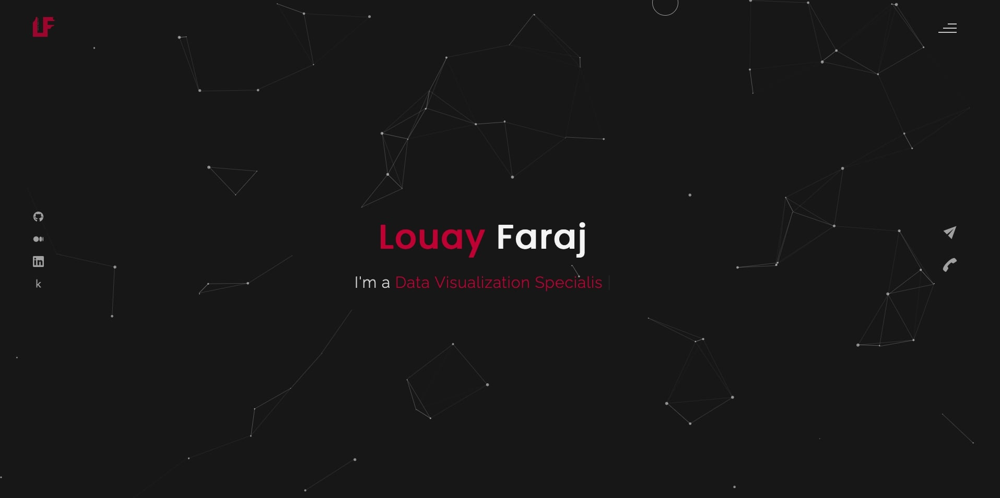

# Louay Faraj's Personal Portfolio Website

Welcome to my personal portfolio website! This project is designed to showcase my skills, projects, and experiences as a data analyst and front-end developer. It features a modern design and dynamic animations to engage visitors.

## Table of Contents

- [Demo](#demo)
- [Features](#features)
- [Technologies Used](#technologies-used)
- [Installation](#installation)
- [Usage](#usage)
- [License](#license)
- [Contact](#contact)

## Demo

Check out the live version of my website [here](https://louaytheanalyst.netlify.app/#contact).

## Features

- **Home**: An engaging introduction to who I am and what I do.
- **About**: Detailed information about my background, skills, and expertise in data analysis and web development.
- **Portfolio**: A showcase of my projects, including data analysis reports and web design work.
- **Blog**: Articles and insights about data science, AI, and other topics of interest.
- **Contact**: A form for visitors to get in touch with me easily.
- **Responsive Design**: Ensures compatibility across a wide range of devices, from desktops to smartphones.

## Technologies Used

- **HTML/CSS**: Provides the structure and styling for the website.
- **JavaScript**: Adds interactivity and dynamic elements to the user experience.
- **GSAP (GreenSock Animation Platform)**: Used for creating high-performance animations, enhancing the visual appeal of the site.
- **jQuery**: Simplifies DOM manipulation and event handling.
- **Particles.js**: Creates visually appealing animated particle backgrounds.
- **Responsive Design**: Utilizes media queries and flexible layouts for cross-device compatibility.

## Usage

Explore the various sections of the website to learn more about my professional work and capabilities. The site is designed to provide a comprehensive overview of my skills and projects, making it easy for potential employers, collaborators, or clients to understand what I offer.

- **Home**: Discover my mission and professional summary.
- **About**: Gain insights into my educational background and technical skills.
- **Portfolio**: Browse through featured projects that highlight my expertise in data analysis and front-end development.
- **Blog**: Read articles and updates on the latest trends in technology and data science.
- **Contact**: Use the contact form to reach out for collaborations or inquiries.

## Contact

For any questions, collaborations, or inquiries, feel free to reach out to me through the following channels:

- **Email**: [louayfaraj41@gmail.com](mailto:louayfaraj41@gmail.com)
- **Phone**: +666-555-20168
- **Location**: Bangkok, Thailand

Connect with me on [GitHub](https://github.com/louayfj), [Medium](https://medium.com/@louayaraj), [LinkedIn](https://www.linkedin.com/in/louayfaraj/), and [Kaggle](https://www.kaggle.com/louayfaraj).

## License

This project is licensed under the [CC BY-NC 4.0 License](https://creativecommons.org/licenses/by-nc/4.0/). This license permits users to view and share the website but not modify it for commercial purposes.

&copy; 2024 Louay Faraj. All rights reserved.
